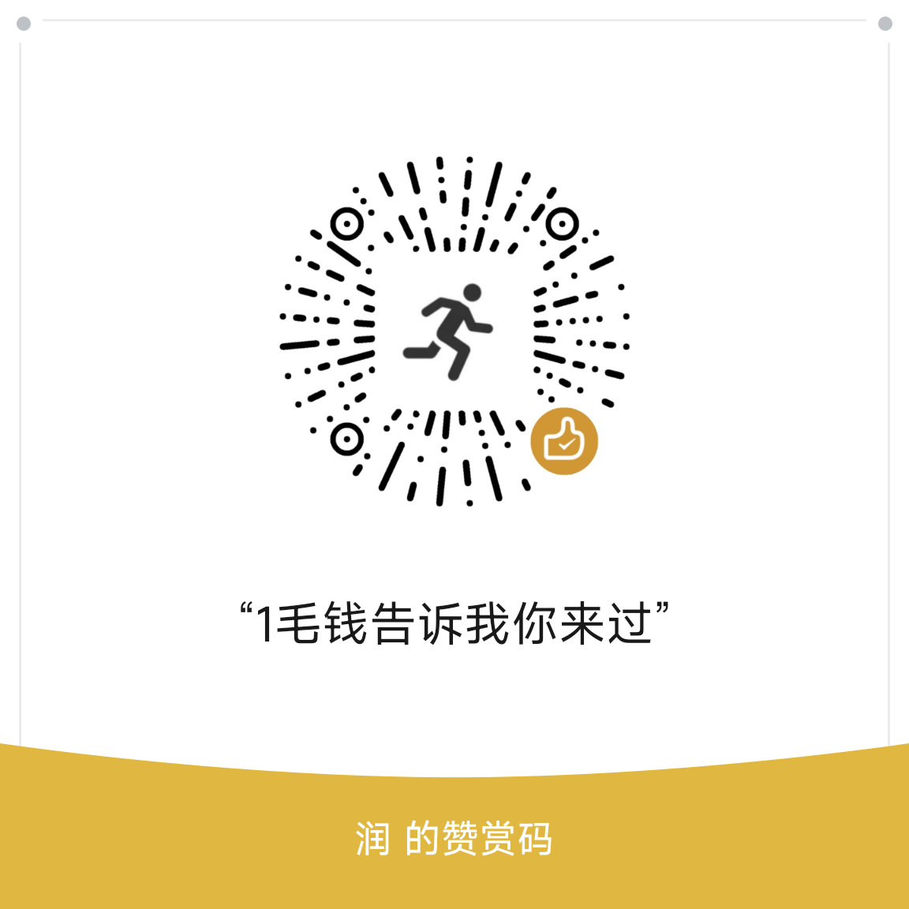

# Obsidian Canvas AI

一个强大的 Obsidian 插件，将 AI 能力深度融入 Canvas 场景，让你在画布上进行非线性对话、快速扩展节点和生成内容。

> 感谢[caret](https://github.com/jcollingj/caret)的灵感  
> fuck flowith.io !!

## 主要特性

- ✅ **Canvas 快速操作**：选中节点时显示悬浮快捷操作条，快速访问 AI 功能
- ✅ **AI 续写**：基于对话血统自动构建上下文，在 Canvas 中生成回复节点
- ✅ **角色管理**：为节点标记 user/assistant/system 角色，清晰展示对话结构
- ✅ **模型管理**：支持多个 OpenAI 兼容模型，灵活切换和管理
- ✅ **本地优先**：所有数据存储在本地，保护隐私，无需外部后端服务
- [ ] **图像生成**：使用 AI 模型生成图片并自动插入到 Canvas
- [ ] **移动端支持**：xxx
---

  以上功能是本项目目标

---

## 安装

### 通过 Obsidian BRAT 插件安装

1. 在社区插件中搜索并安装 [BRAT (Beta Reviewers Auto-update Tool)](https://github.com/TfTHacker/obsidian42-brat)
2. 启用 BRAT 插件
3. 打开 BRAT 设置，点击「Add beta plugin」
4. 在弹出框填写插件仓库地址：`mmmmmmmgo/obsidian-canvas-ai`
5. 确认添加，BRAT 会自动下载并安装 Canvas AI 插件
6. 在插件列表启用 Obsidian Canvas AI

### 手动安装

1. 从 [Releases](https://github.com/your-repo/obsidian-canvas-ai/releases) 下载最新版本
2. 将下载的文件解压到你的 Obsidian vault 的 `.obsidian/plugins/obsidian-canvas-ai/` 目录
3. 重启 Obsidian 或重新加载插件

## 使用说明

### 快速开始

选中 Canvas 中的文本节点后，会显示快捷操作条，点击 AI 按钮即可开始使用。

### Canvas 快速操作

当你在 Canvas 中选中单个节点时，会在节点附近显示一个快捷操作条，包含以下功能：

<!-- TODO: 添加快速操作条演示 GIF -->
<!--  -->

- **AI 按钮**：基于当前节点和对话血统生成回复
- **角色切换**：为节点标记 user/assistant/system 角色
- **方向创建**：在指定方向创建新节点
- **更多操作**：访问其他扩展功能

### AI 续写功能

<!-- TODO: 添加 AI 续写演示视频 -->
<!--  -->

插件会基于节点的最长血统路径自动构建对话上下文，并在画布中生成新的回复节点。

**上下文包含**：
- 选中节点的文本内容
- 对话血统路径上的所有节点
- 自动展开的 `[[引用]]` 链接
- 链接的 Markdown 文件内容
- 网页链接的全文内容（如果节点包含链接）

### 角色管理

<!-- TODO: 添加角色管理演示 GIF -->
<!--  -->

为节点设置角色可以帮助你更好地组织对话结构：

- **User**：用户消息节点
- **Assistant**：AI 回复节点
- **System**：系统提示节点

节点上会显示对应的角色标识。

### 血统高亮

<!-- TODO: 添加血统高亮演示 GIF -->
<!--  -->

选中节点时，插件会自动高亮该节点的最长血统路径。

### ~~图像生成~~

in progress...

### 模型管理

<!-- TODO: 添加模型设置界面截图 -->
<!--  -->

支持管理多个 OpenAI 兼容模型，可配置 API 地址、密钥、上下文窗口和能力标签（流式输出、函数调用、视觉能力）。

## 设置说明

### 基本设置

- **默认模型**：选择用于 Canvas 续写的主要模型
- **图像生成模型**：选择用于生成图片的模型
- **系统提示词**：全局系统提示，会追加到所有续写请求中
- **展开嵌套引用**：是否自动展开 `[[引用]]` 中的嵌套引用
- **上下文裁剪警告**：当上下文超过模型窗口时是否显示警告

### 模型配置

每个模型需要配置：

- **模型 ID**：唯一标识符
- **显示名称**：在界面中显示的名称
- **API 地址**：OpenAI 兼容接口的地址
- **API 密钥**：访问接口所需的密钥
- **上下文窗口**：模型支持的最大 token 数
- **能力标签**：
  - 流式输出：支持流式响应
  - 函数调用：支持函数调用功能
  - 视觉能力：支持图像输入

### 快速操作设置

可自定义快捷操作条的显示选项。

## 使用场景示例

### 场景 1：头脑风暴

<!-- TODO: 添加头脑风暴场景演示 -->
<!--  -->

在 Canvas 中创建中心节点，使用 AI 生成想法，为不同分支设置角色，沿着血统路径继续扩展。

### 场景 2：对话式写作

<!-- TODO: 添加对话式写作场景演示 -->
<!--  -->

创建 user 节点作为问题，使用 AI 生成 assistant 回复，继续对话构建完整的对话树。

### 场景 3：知识整理

<!-- TODO: 添加知识整理场景演示 -->
<!--  -->

在节点中引用其他笔记，AI 会自动展开引用内容作为上下文，基于完整上下文生成相关内容。

## 赏饭

